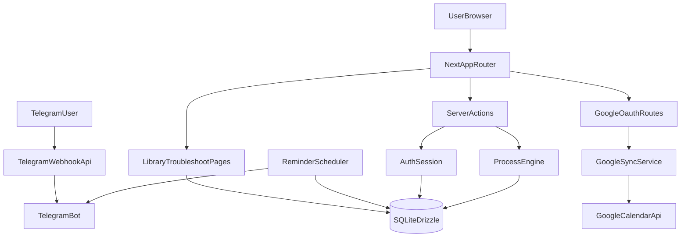

# Architecture

This document explains how Bread Pitt is structured, how data moves through the system, and where each responsibility lives.

Related docs: [design.md](design.md), [data-model.md](data-model.md), [operations-runbook.md](operations-runbook.md)

## 1) System overview

Bread Pitt is a monolithic Next.js application with:

- App Router pages for UI
- Server Actions for most mutations
- SQLite (via Drizzle ORM) for persistent state
- An in-process scheduler for reminder dispatch
- Optional external integrations (Telegram and Google Calendar)

Core design choice: the app favors a single deployable unit over microservices, which keeps local development and self-hosting simple.

## 2) Runtime topology

## 3) Codebase layout

- `app`: Next.js routes and API endpoints
  - `app/(app)`: authenticated product surfaces
  - `app/(auth)`: login
  - `app/api`: health, Telegram webhook, Google OAuth routes
- `components`: reusable UI primitives and layout pieces
- `lib`: business logic and platform services
  - `lib/processes`: process engine and templates
  - `lib/db`: DB client and schema
  - `lib/auth`: session handling
  - `lib/scheduler`: reminder scheduler
  - `lib/telegram`: bot, pairing, message templates
  - `lib/google`: OAuth, Calendar adapter, sync logic
  - `lib/knowledge`: markdown parsing/indexing
- `scripts`: migration, knowledge sync, admin seed, backups
- `drizzle`: SQL migrations and metadata
- `docker`, `Dockerfile`, `docker-compose.yml`, `Caddyfile`: runtime packaging and deployment

## 4) Request flow

### Read path

1. Browser requests a page in `app/(app)`.
2. Middleware checks session cookie and redirects to `/login` if needed.
3. Server Components query Drizzle/SQLite (often via utility functions).
4. React renders HTML and client interactivity layers.

### Write path

1. User submits a form or button action.
2. Server Action executes in Node runtime.
3. Domain logic updates tables through Drizzle.
4. Optional side effects run (e.g., Google Calendar sync).
5. UI revalidates and reflects the updated state.

## 5) Authentication architecture

- Session cookie: `bread_pitt_session`
- Session token: signed JWT (`HS256`) using `SESSION_SECRET`
- Session persistence: `sessions` table is checked on each read
- Route gate: `middleware.ts` protects authenticated routes

Security implication: authentication is both token-based and DB-backed, so deleting a DB session invalidates a token immediately.

## 6) Process and reminder architecture

### Process engine

`lib/processes/engine.ts` is the domain orchestrator:

- starts process runs from templates
- materializes `process_steps` and `reminders`
- handles lifecycle transitions (pause, resume, restart, abandon)
- marks completion state
- writes observations

### Template model

Each template computes relative times and metadata from:

- start time
- kitchen temperature
- user options

This allows deterministic process creation and easier testing.

### Reminder scheduler

`lib/scheduler/cron.ts` runs every 30 seconds:

- fetches pending reminders due now
- enforces quiet hours/preferences
- dispatches via Telegram
- retries with exponential backoff
- reconciles missed reminders at boot

## 7) Knowledge architecture

Source of truth files:

- `sourdough_complete_guide.md`
- `sourdough_discard_and_starter_care.md`

Pipeline:

1. Parse markdown into section hierarchy.
2. Render HTML per section.
3. Populate `guide_sections` and `troubleshoot_rows`.
4. Build/update FTS5 search index (`guide_search`).

Outcome: library and troubleshooting pages are data-backed and searchable.

## 8) Integration boundaries

### Telegram boundary

- Inbound: webhook requests hit `/api/telegram/webhook`
- Outbound: scheduler and command handlers call Telegram Bot API
- Identity binding: user-to-chat mapping stored in `users.telegramChatId`

### Google boundary

- OAuth start/callback routes establish account connection
- Tokens are stored in `google_accounts`
- Process lifecycle triggers sync functions to upsert/cancel events

## 9) Deployment architecture

Container startup sequence:

1. run migrations
2. sync knowledge
3. optional admin seed
4. start Next standalone server

Reverse proxy (Caddy) handles TLS and forwards traffic to app container.

Persistent data lives in `data/` (SQLite DB, WAL/SHM, backups, uploads).

## 10) Verification checklist

- `pnpm dev` launches app and protected routes redirect correctly.
- `pnpm db:migrate` succeeds and DB file appears in `data/`.
- Starting a process creates rows in `processes`, `process_steps`, `reminders`.
- Scheduler logs show periodic tick activity.
- `/api/health` returns `ok` with status 200.

