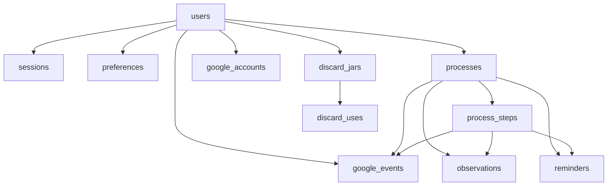

# Data Model

This document explains the Bread Pitt database schema, table responsibilities, and lifecycle relationships.

Source of truth: `lib/db/schema.ts`

Related docs: [architecture.md](architecture.md), [api-and-actions.md](api-and-actions.md), [operations-runbook.md](operations-runbook.md)

## 1) Database technology

- Engine: SQLite (`better-sqlite3`)
- ORM: Drizzle
- Migration tool: `drizzle-kit` + `scripts/migrate.ts`
- DB file: `data/bread-pitt.db` (with `-wal` and `-shm` files under WAL mode)

## 2) High-level entity groups

- Identity and access: `users`, `sessions`, `preferences`, `setup_tokens`
- Process execution: `processes`, `process_steps`, `observations`, `reminders`
- Integrations: `google_accounts`, `google_events`
- Discard tracking: `discard_jars`, `discard_uses`
- Knowledge base: `guide_sections`, `troubleshoot_rows` (+ FTS virtual table)

## 3) Core relational map

## 4) Table-by-table reference

### `users`

Purpose:

- stores the single app user identity and login hash
- stores Telegram pairing data

Key fields:

- `password_hash`
- `display_name`
- `telegram_chat_id`
- `telegram_pairing_code`, `telegram_pairing_expires_at`

### `sessions`

Purpose:

- persistent session rows mapped to JWT cookie claims

Key fields:

- `id` (session id)
- `user_id`
- `expires_at`

### `preferences`

Purpose:

- user-level runtime preferences and integration toggles

Key fields:

- `theme`
- `kitchen_temp_f`
- `notifications_enabled`
- `quiet_hours_start`, `quiet_hours_end`
- `starter_nickname`
- `google_calendar_sync_enabled`

### `setup_tokens`

Purpose:

- first-run setup tokens for setup flows

### `processes`

Purpose:

- one row per process run lifecycle

Key fields:

- `type` (`starter_build`, `bake_day`, `weekly_maintenance`, `discard_purge`, `revival`)
- `status` (`active`, `paused`, `completed`, `abandoned`)
- `started_at`, `paused_at`, `completed_at`
- `options_json`
- `extension_days`

### `process_steps`

Purpose:

- precomputed timeline steps for a process run

Key fields:

- `step_key`
- `ordinal`
- `scheduled_for`
- `completed_at`
- `skipped`, `skipped_reason`
- `metadata_json`

### `observations`

Purpose:

- user-recorded notes/measurements/photos tied to process and optional step

Key fields:

- `kind` (`smell`, `rise`, `bubble`, `photo`, `temperature`, `free`)
- `value_json`
- `body`
- `photo_path`
- `recorded_at`

### `reminders`

Purpose:

- durable reminder queue consumed by scheduler

Key fields:

- `channel` (currently `telegram`)
- `fire_at`
- `status` (`pending`, `sent`, `failed`, `cancelled`)
- `attempts`
- `last_error`

### `google_accounts`

Purpose:

- stores OAuth account and token metadata

Key fields:

- `email`
- `access_token`
- `refresh_token`
- `expires_at`
- `calendar_id`

### `google_events`

Purpose:

- maps app steps to Google Calendar event identifiers

Key fields:

- `step_id` (unique)
- `event_id`
- `calendar_id`
- `status`
- `last_synced_at`

### `discard_jars`

Purpose:

- tracks each discard jar lifecycle

Key fields:

- `opened_at`
- `closed_at`
- `current_grams`

### `discard_uses`

Purpose:

- logs recipe use entries against a discard jar

Key fields:

- `recipe_key`, `recipe_name`
- `grams_used`
- `rating`
- `used_at`

### `guide_sections`

Purpose:

- stores parsed guide sections from markdown

Key fields:

- `slug`, `parent_slug`
- `title`, `ordinal`, `depth`
- `content_md`, `content_html`, `excerpt`
- `content_hash`

### `troubleshoot_rows`

Purpose:

- structured symptom/diagnosis/fix rows extracted from guide tables

## 5) Lifecycle behaviors represented in data

### Process lifecycle

- `active`: running
- `paused`: temporarily frozen
- `completed`: finished all actionable steps
- `abandoned`: stopped by user or replaced by restart flow

### Reminder lifecycle

- `pending` -> `sent`
- `pending` -> `failed` (after retry threshold)
- `pending` -> `cancelled` (pause, step completion, or settings logic)

## 6) Indexing strategy

Important indexes include:

- `processes_status_idx`
- `process_steps_process_idx`
- `process_steps_scheduled_idx`
- `reminders_pending_idx`
- `google_events_process_idx`
- `google_events_user_idx`
- `guide_sections_parent_idx`

These support fast dashboard, scheduler, and journal queries.

## 7) Migration model

- Migrations live in `drizzle/*.sql`.
- Metadata lives in `drizzle/meta`.
- Runtime migrations are applied by `scripts/migrate.ts`.
- `scripts/migrate.ts` also ensures FTS virtual table creation.

## 8) Operational cautions

- DB file path is effectively fixed by `lib/db/client.ts`.
- WAL mode creates sidecar files (`.db-wal`, `.db-shm`).
- Backup tooling must account for WAL-safe snapshots.
- OAuth tokens are currently stored plaintext at rest.

## 9) Verification checklist

- Run `pnpm db:migrate` and confirm no migration errors.
- Start a process and verify inserted rows in process/reminder tables.
- Complete steps and verify status transitions.
- Run `pnpm knowledge:sync` and verify guide/troubleshoot tables are updated.

